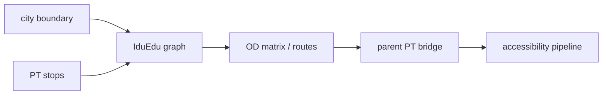

# iduedu-fork

Forked IduEdu backend used for intermodal graph construction, stop handling, and OD/accessibility support in the dissertation pipeline.

## System Map



## Main Result


## Run

Entrypoint: `docs/examples/get_any_graph.ipynb`

Human:

```bash
pip install -e . && jupyter notebook docs/examples/get_any_graph.ipynb
```

Agent: use cache deliberately and preserve stop/mapping artifacts when bridging PT layers.

## Publication

Upstream docs: https://iduclub.github.io/IduEdu/

## Next Steps / Heuristics

Heuristic: explicit graph modes and local UTM handling are preferable to ad hoc network/projection helpers in the parent repo.
