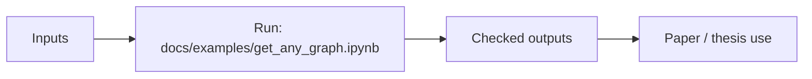

# iduedu-fork

Forked IduEdu intermodal graph and OD-matrix backend.

## Scheme



## Main Result


## Run

Entrypoint: `docs/examples/get_any_graph.ipynb`

Human:

```bash
pip install -e . && jupyter notebook docs/examples/get_any_graph.ipynb
```

Agent:

Use cache deliberately and preserve stop/mapping artifacts for PT bridges.

## Publication

Upstream docs: https://iduclub.github.io/IduEdu/

## Next Steps / Heuristics

Heuristic: local UTM and explicit graph modes beat ad hoc projection/network helpers.
